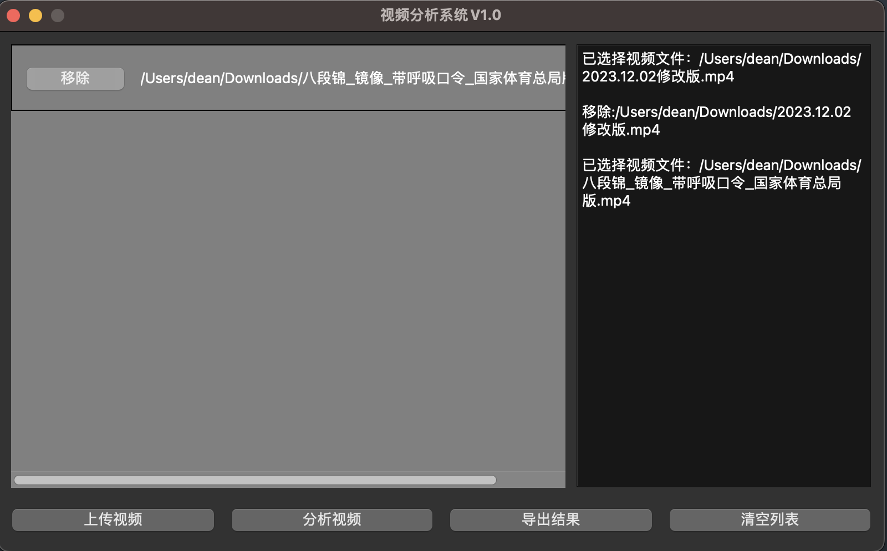

# 基于Pyside6 开发的视频分析软件

## 界面




## 软件结构

- [x] 上传视频：支持mp4/avi 格式
- [x] 分析视频：按照毫秒逐帧分析
- [] 导出结果：导出excel或者csv
- [x] 清空列表：清空列表和日志信息


## QA 

1. QA: 当分析视频时，日志无法实时显示更新
   Solution: Signal failed, Timer failed, and Test MultiThread.


## Build&Deploy

```sh
pip install briefcase
# init
briefcase new
# dev
briefcase dev
# package


```